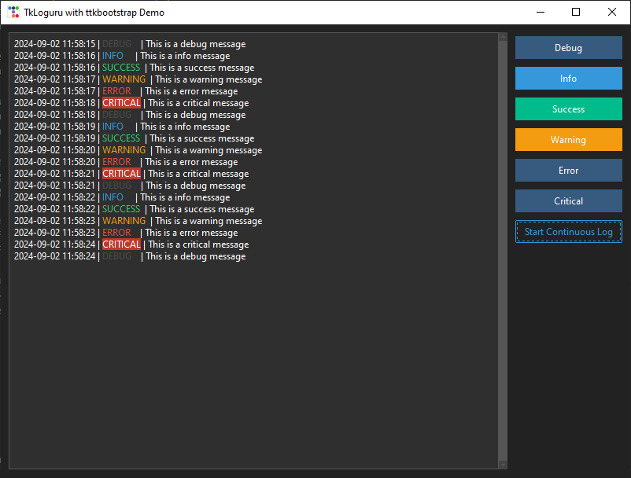

# Loguru Tkinter Widget

A thread-safe, customizable Tkinter widget for displaying Loguru logs in real-time.



## Features

- Real-time log display in a Tkinter application
- Thread-safe implementation using a queue
- Customizable color modes for log levels
- Adjustable maximum number of displayed log lines
- Optional scrollbar
- Easy integration with existing Loguru logger

## Installation

1. Ensure you have Python 3.6+ installed on your system.
2. Install the required dependencies:

```bash
pip install tkloguru
```

3. Copy the `LoguruWidget` class and related functions into your project.

## Usage

Here's a basic example of how to use the Loguru Tkinter Widget:

```python
import tkinter as tk
from loguru import logger
from loguru_widget import LoguruWidget, setup_logger

root = tk.Tk()
root.title("Loguru Tkinter Widget Demo")
root.geometry("600x400")

log_widget = LoguruWidget(root, show_scrollbar=True, color_mode='level', max_lines=1000)
log_widget.pack(expand=True, fill=tk.BOTH, padx=10, pady=10)

setup_logger(log_widget)

# Example log messages
logger.debug("This is a debug message")
logger.info("This is an info message")
logger.success("This is a success message")
logger.warning("This is a warning message")
logger.error("This is an error message")
logger.critical("This is a critical message")

root.mainloop()
```

## Customization

The `LoguruWidget` class accepts several parameters for customization:

- `master`: The parent Tkinter widget (required)
- `show_scrollbar`: Boolean to show/hide the scrollbar (default: True)
- `color_mode`: String to set the coloring mode ('level', 'message', or 'full') (default: 'level')
- `max_lines`: Integer to set the maximum number of displayed log lines (default: 1000)

## Contributing

Contributions are welcome! Please feel free to submit a Pull Request.

## License

This project is licensed under the MIT License - see the [LICENSE](LICENSE) file for details.

## Acknowledgments

- [Loguru](https://github.com/Delgan/loguru) for the excellent logging library
- [Tkinter](https://docs.python.org/3/library/tkinter.html) for the GUI framework
